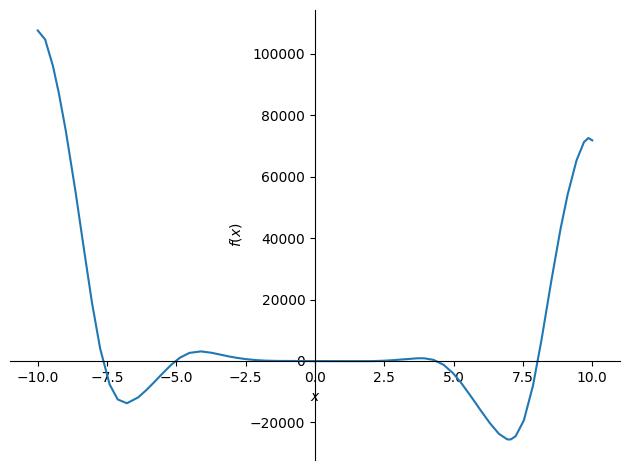
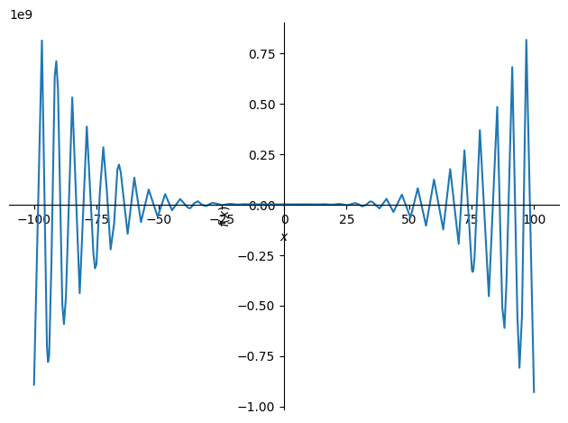
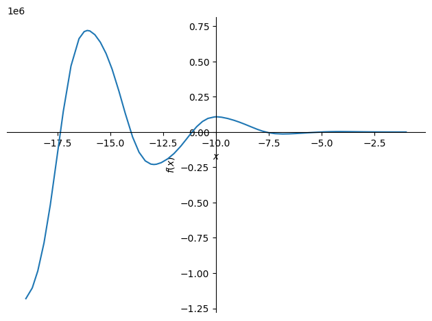
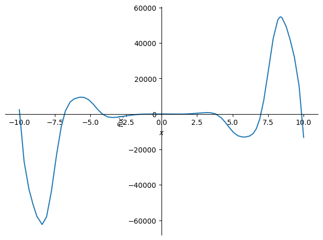
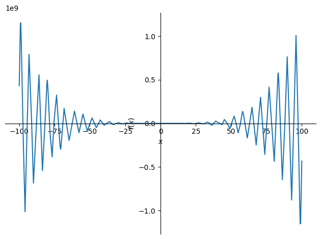
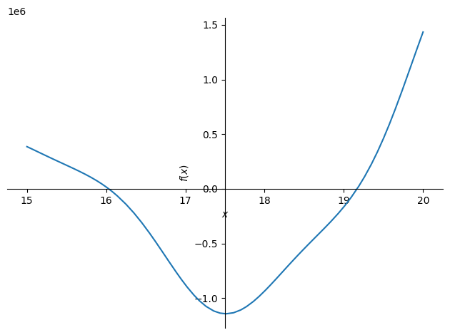

```python
from sympy import diff,symbols, cos, sin
from sympy.solvers import solve, nsolve, solveset
```


```python
x, y = symbols('x y')
```


```python
f = -12*x**4*sin(cos(x)) -18*x**3 + 5*x**2 +10*x -30

```


```python
from sympy.plotting import plot as symplot
symplot(f)
```


    

    


    <sympy.plotting.plot.Plot at 0x7f3bb369f850>


```python
symplot(f, (x,-100,100))
```


    

    


    <sympy.plotting.plot.Plot at 0x7f3bc82fe140>


```python
symplot(f, (x,-19,-1))
```


    

    


    <sympy.plotting.plot.Plot at 0x7f3b98637490>


```python
#поиск корней, ориентируясь на графики
from sympy.solvers import nsolve
roots = [nsolve(f, x, -18),
 nsolve(f, x, -15),
 nsolve(f, x, -12),
 nsolve(f, x, -8),
 nsolve(f, x, -6),
 nsolve(f, x, -2),
 nsolve(f, x, 2),
 nsolve(f, x, 4),
 nsolve(f, x, 8),
 nsolve(f, x, 10),
 nsolve(f, x, 14)
]
roots
```


    [-17.3665525069077,
     -14.0280559916623,
     -11.1337690610358,
     -7.65062228513275,
     -5.02686592820621,
     -1.33896663927711,
     2.27305684575625,
     4.38352369796896,
     8.03516413341352,
     10.8606499895942,
     14.2405848102516]


```python
#список интервалов
intervals_between_roots = list(zip(roots, roots[1:]))
intervals_between_roots
```


    [(-17.3665525069077, -14.0280559916623),
     (-14.0280559916623, -11.1337690610358),
     (-11.1337690610358, -7.65062228513275),
     (-7.65062228513275, -5.02686592820621),
     (-5.02686592820621, -1.33896663927711),
     (-1.33896663927711, 2.27305684575625),
     (2.27305684575625, 4.38352369796896),
     (4.38352369796896, 8.03516413341352),
     (8.03516413341352, 10.8606499895942),
     (10.8606499895942, 14.2405848102516)]


```python
#интервалы значений > 0
positive_values = intervals_between_roots[::2]
positive_values
```


    [(-17.3665525069077, -14.0280559916623),
     (-11.1337690610358, -7.65062228513275),
     (-5.02686592820621, -1.33896663927711),
     (2.27305684575625, 4.38352369796896),
     (8.03516413341352, 10.8606499895942)]


```python
#интервалы значений < 0
negative_values = intervals_between_roots[1:][::2]
negative_values
```


    [(-14.0280559916623, -11.1337690610358),
     (-7.65062228513275, -5.02686592820621),
     (-1.33896663927711, 2.27305684575625),
     (4.38352369796896, 8.03516413341352),
     (10.8606499895942, 14.2405848102516)]


```python
#производная
dif = diff(-12*x**4*sin(cos(x)) -18*x**3 + 5*x**2 +10*x -30, x)
symplot(dif)
```


    

    


    <sympy.plotting.plot.Plot at 0x7f3b957546d0>


```python
symplot(dif, (x,-100,100))
```


    

    


    <sympy.plotting.plot.Plot at 0x7f3b957578b0>


```python
symplot(dif, (x,15,20))
```


    

    


    <sympy.plotting.plot.Plot at 0x7f3b958cdae0>


```python
#поиск корней производной (точки экстремумов), ориентируясь на графики
dif_roots = [
 nsolve(dif, x, -19),
 nsolve(dif, x, -16),
 nsolve(dif, x, -13),
 nsolve(dif, x, -10),
 nsolve(dif, x, -7),
 nsolve(dif, x, -4),
 nsolve(dif, x, -1),
 nsolve(dif, x, 0.5),
 nsolve(dif, x, 1.7),
 nsolve(dif, x, 4),
 nsolve(dif, x, 7),
 nsolve(dif, x, 10),
 nsolve(dif, x, 13),
 nsolve(dif, x, 20)
]
dif_roots
```


    [-19.1307079119221,
     -16.0805175716342,
     -12.9438052089824,
     -9.97895376101509,
     -6.83137004000085,
     -4.16778352385048,
     -0.392677179932750,
     0.454573568108782,
     1.70060727795121,
     3.81931083338228,
     7.00103165854095,
     9.87714905397232,
     13.0123448285001,
     19.1674784504931]


```python
#список интервалов производной
intervals_between_dif_roots = list(zip(dif_roots, dif_roots[1:]))
intervals_between_dif_roots
```


    [(-19.1307079119221, -16.0805175716342),
     (-16.0805175716342, -12.9438052089824),
     (-12.9438052089824, -9.97895376101509),
     (-9.97895376101509, -6.83137004000085),
     (-6.83137004000085, -4.16778352385048),
     (-4.16778352385048, -0.392677179932750),
     (-0.392677179932750, 0.454573568108782),
     (0.454573568108782, 1.70060727795121),
     (1.70060727795121, 3.81931083338228),
     (3.81931083338228, 7.00103165854095),
     (7.00103165854095, 9.87714905397232),
     (9.87714905397232, 13.0123448285001),
     (13.0123448285001, 19.1674784504931)]


```python
#интервалы возрастания функции
dif_positive_values = intervals_between_dif_roots[::2]
dif_positive_values
```


    [(-19.1307079119221, -16.0805175716342),
     (-12.9438052089824, -9.97895376101509),
     (-6.83137004000085, -4.16778352385048),
     (-0.392677179932750, 0.454573568108782),
     (1.70060727795121, 3.81931083338228),
     (7.00103165854095, 9.87714905397232),
     (13.0123448285001, 19.1674784504931)]


```python
#интервалы убывания функции
dif_negative_values = intervals_between_dif_roots[1:][::2]
dif_negative_values
```


    [(-16.0805175716342, -12.9438052089824),
     (-9.97895376101509, -6.83137004000085),
     (-4.16778352385048, -0.392677179932750),
     (0.454573568108782, 1.70060727795121),
     (3.81931083338228, 7.00103165854095),
     (9.87714905397232, 13.0123448285001)]


